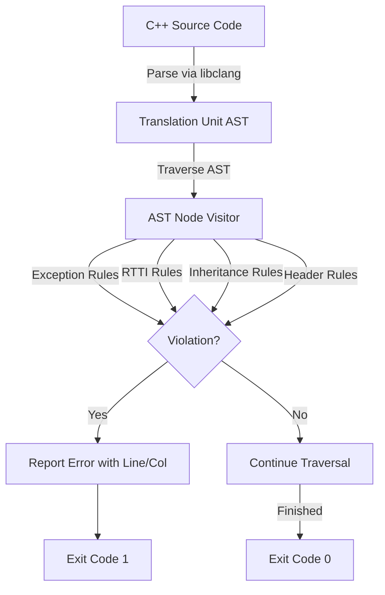

# Orthodox C++ Checker (occ)

`occ` is a static analysis tool built in Python using `libclang` to parse C++ source files and enforce the **Orthodox C++** programming standard. 

The Orthodox C++ standard is a subset of the C++ language that rejects complex, high-overhead runtime and compilation features in favor of simplicity, predictability, and fast compilation.

---

## Architectural Overview

`occ` interacts with the LLVM frontend via Python's `libclang` bindings to parse target files into an Abstract Syntax Tree (AST). It then performs a recursive depth-first traversal of the AST, applying specific rule checkers to each node.



---

## Enforced Rules

`occ` enforces the following Orthodox C++ restrictions:

1. **No Exception Handling**: 
   - Rejects `throw` expressions.
   - Rejects `try-catch` statements.
   - Requires compile-time or return-code error management.

2. **No Run-Time Type Information (RTTI)**:
   - Rejects `dynamic_cast` expressions.
   - Rejects `typeid` queries.

3. **Restricted Inheritance**:
   - Rejects **virtual inheritance** (prevents complex pointer adjustments and layout overhead).
   - Rejects **multiple inheritance** (except when inheriting from multiple interface classes, which we check by ensuring all parent classes except the first are pure interface classes).

4. **Header and Library Constraints**:
   - Rejects usage of heavy standard libraries like `<iostream>` and `<sstream>` which introduce significant code bloat and runtime overhead.
   - Recommends C-style headers or custom minimal alternatives.

---

## Requirements & Setup

- **Python**: 3.12+
- **LLVM/Clang**: Requires `libclang.dll` on Windows.
  - Recommended setup: MSYS2 UCRT64 environment.
  - Install the Clang runtime libraries:
    ```bash
    pacman -S mingw-w64-ucrt-x86_64-clang-libs
    ```

### Virtual Environment
Setup a python virtual environment and install dependencies:
```powershell
python -m venv .venv
.venv\Scripts\pip install -r requirements.txt
```

---

## Usage

```powershell
.venv\Scripts\python occ.py <file-or-directory-path>
```

### Exit Codes:
- `0`: All files conform to the Orthodox C++ subset.
- `1`: Violations were found, or compilation/parsing errors occurred.
